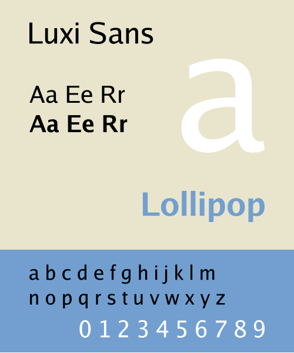

# Luxi Fonts



## Introduction

In 2001, Bigelow & Holmes contributed TrueType versions of the basic Luxi family to the X Consortium.
These original files are still available and can be freely downloaded, but they can be hard to find.
So I tracked them down and wrote a script to convert them into a new package of OTFs, TTFs, and webfonts.

## Build

```bash
$ ./build.sh
$ ls dist/*.zip
dist/LuxiMono.zip
dist/LuxiSans.zip
dist/LuxiSerif.zip
```

## License

See [COPYRIGHT.BH](./COPYRIGHT.BH).

## Related

- [Utopia](https://github.com/basil/adobe-utopia-type1)
- [Bitstream fonts](https://github.com/basil/bitstream-type1)
- [IBM Courier](https://github.com/basil/ibm-type1)
- [URW base 35 fonts](https://github.com/basil/urw-base35-fonts)
- [URW free fonts](https://github.com/basil/urw-free-fonts)

## Original

All questions regarding this software should be directed at the
Xorg mailing list:

  https://lists.x.org/mailman/listinfo/xorg

The primary development code repository can be found at:

  https://gitlab.freedesktop.org/xorg/font/bh-ttf

Please submit bug reports and requests to merge patches there.

For patch submission instructions, see:

  https://www.x.org/wiki/Development/Documentation/SubmittingPatches

